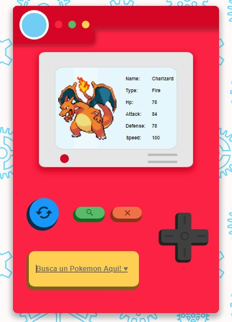
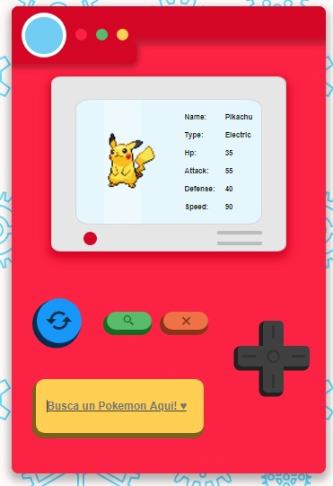

# Pokedex

Este es un pequeño ejercicio de consumo de API´s y manipulacion del DOOM con JavaScript, además un poco de dibujo con CSS.

Toda la estructura de la Pokedex esta dibujada con CSS y los datos de cada Pokémon se traen de la [Poke Api](https://pokeapi.co/), puedes buscar un Pokémon por nombre, ir adelante, atrás, obtener un Pokémon random o eliminar el Pokémon que esta en pantalla.

En este ejercicio puse en practica las siguientes habilidades:

* HTML
* CSS
* JavaScript

El deploy del proyecto esta hecho en Github Pages.

### [Preview](https://gallardior.github.io/Pokedex/)

